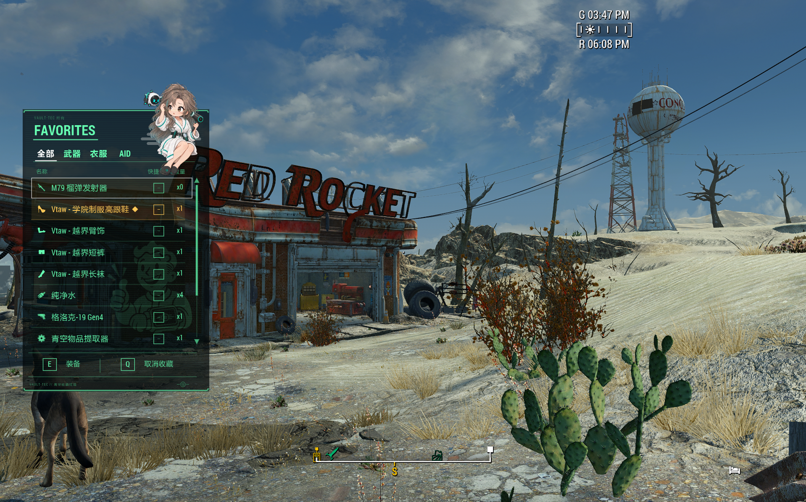

# AozoraFavorites Ultimate Edition

### 青空收藏菜单 - 终极版

**A SkyUI-style side favorites menu for Fallout 4, built to go beyond the vanilla 12-item favorites limit.** 
**一款 SkyUI 风格的 Fallout 4 侧边收藏栏，突破原版最多 12 个收藏物品的限制。**

  

## Highlights · 功能特色

- Browse All, Weapons, Outfits, and Aid in a compact side menu; see equipped status and equip, unequip, or use items directly. 
  在紧凑的侧边菜单中浏览全部、武器、服装和 AID；查看装备状态，并直接装备、卸下或使用物品。
- Press keyboard **Q** to add an item to favorites, then assign its hotkey in Aozora Favorites. 
  使用键盘 **Q** 收藏物品，再在青空收藏菜单中为物品分配快捷键。
- Number-key hotkey assignment in the vanilla Pip-Boy is disabled. Aozora-assigned number hotkeys remain usable during gameplay. 
  原版哔哔小子中的数字键快捷键分配已禁用；在青空收藏菜单中分配的数字快捷键仍可在游戏中使用。
- Gamepad navigation is supported. Configure a single D-pad direction to open the menu and set unused directions to **No Action**. 
  支持手柄操作；可指定一个十字键方向打开菜单，并将其余方向设为**无操作**。
- Uses FIS icons and category data when available, with a built-in fallback icon set when FIS is not installed. FIS is optional. 
  检测到 FIS 时优先使用其图标和分类；未安装 FIS 时自动使用内置兜底图标。FIS 为可选组件。
- The mascot can be hidden. When shown, one of five pose series is randomly selected each time the menu opens; changing focus switches poses within that same series. 
  可以隐藏辐射娘；显示时，每次打开菜单都会随机选取五个系列之一，移动焦点时则在当前系列中切换姿势。
- Match the HUD color or choose from six presets; sort all favorites by name or usage frequency, and choose how game time behaves while the menu is open. 
  配色可跟随 HUD 或从六种预设中选择；全部收藏可按名称或使用频率排序，也可设置菜单打开时的游戏时间速度。

## Requirements · 前置要求

- Fallout 4. 
  Fallout 4（辐射 4）。
- [Fallout 4 Script Extender (F4SE)](https://f4se.silverlock.org/) — install the release matching your Fallout 4 runtime. 
  [Fallout 4 Script Extender (F4SE)](https://f4se.silverlock.org/)（辐射 4 脚本扩展器）——请安装与游戏运行时版本匹配的发行版。
- [Address Library for F4SE Plugins](https://www.nexusmods.com/fallout4/mods/47327). 
  [Address Library for F4SE Plugins](https://www.nexusmods.com/fallout4/mods/47327)（F4SE 插件地址库）。
- [Mod Configuration Menu (MCM)](https://www.nexusmods.com/fallout4/mods/21497) for in-game settings. 
  [Mod Configuration Menu (MCM)](https://www.nexusmods.com/fallout4/mods/21497)（模组配置菜单），用于游戏内设置。
- The menu uses Fallout 4's vanilla SWF interface. No separate UI framework is required. 
  菜单基于 Fallout 4 原版 SWF 界面，无需额外 UI 框架。

## Installation · 安装

1. Install the requirements above, then install **AozoraFavorites Ultimate Edition** with your mod manager. 
   安装以上前置，再使用模组管理器安装 **AozoraFavorites Ultimate Edition**。
2. To use the Chinese interface, install **AozoraFavorites Ultimate Edition CHS Patch** after the English core mod so its translation file overwrites the original. 
   使用中文界面时，请先安装英文核心版，再安装 **AozoraFavorites Ultimate Edition CHS Patch**，让汉化文件覆盖原翻译文件。
3. The current Chinese patch replaces the English translation file; set the game's language to English (`sLanguage=en`) for it to load. 
   当前汉化补丁覆盖的是英文翻译文件；请将游戏语言设为 English（`sLanguage=en`），以确保汉化生效。

## Build from source · 从源码构建

- Build the SWF with `tools/bootstrap-flex.ps1` and `tools/build-swf.ps1`; build mascot and silhouette DDS files with `tools/build-skyui-like-assets.ps1` (requires DirectXTex `texconv`). 
  使用 `tools/bootstrap-flex.ps1` 和 `tools/build-swf.ps1` 构建 SWF；使用 `tools/build-skyui-like-assets.ps1` 构建吉祥物与剪影 DDS（需要 DirectXTex 的 `texconv`）。
- Build the native plugin with xmake and CommonLibF4; set `COMMONLIBF4_PATH` to your CommonLibF4 checkout. Then use `tools/package-formal-release-v1n.ps1` to assemble the installable packages. 
  使用 xmake 和 CommonLibF4 构建原生插件；将 `COMMONLIBF4_PATH` 指向 CommonLibF4 源码目录，再运行 `tools/package-formal-release-v1n.ps1` 生成安装包。
